# Autonomous-Robot-Environment

A 3D simulation of a two-wheeled robot on an indoor office floor (corridor,
office, lab, storage, reception, doorways, furniture). It is built so that a
rapid decision model
can later drive it. This version is the static foundation: you
drive the robot to a goal by hand, through the same safety layer that any
automatic driver will use later.

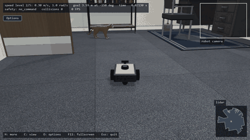

*The baseline driver takes the robot from the office to the lab while four cats wander,
sit, and walk around it: chase view, then the robot's own camera, then the top view at the
goal. Full-quality video: [docs/demo.mp4](docs/demo.mp4). Recorded with
`.venv\Scripts\python tools\make_media.py` (goal seed 1000, speed level 2, 4 cats, cat seed 16;
every image here comes from that tool). The window starts with four cats; the **Options** button
on the panels changes the number (0 to 4), and `--cats N` sets it at start.*

| | |
|---|---|
| 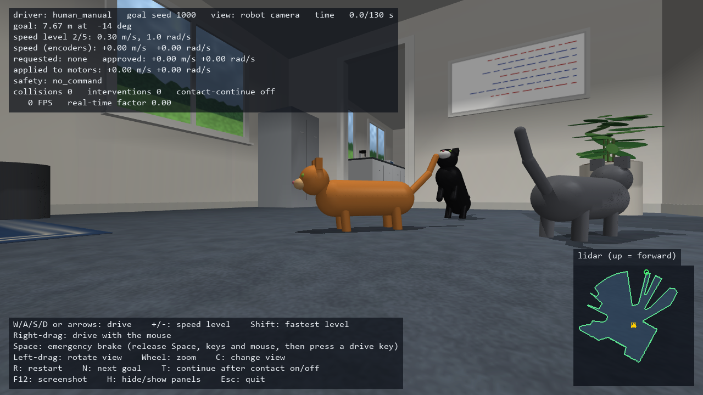 | 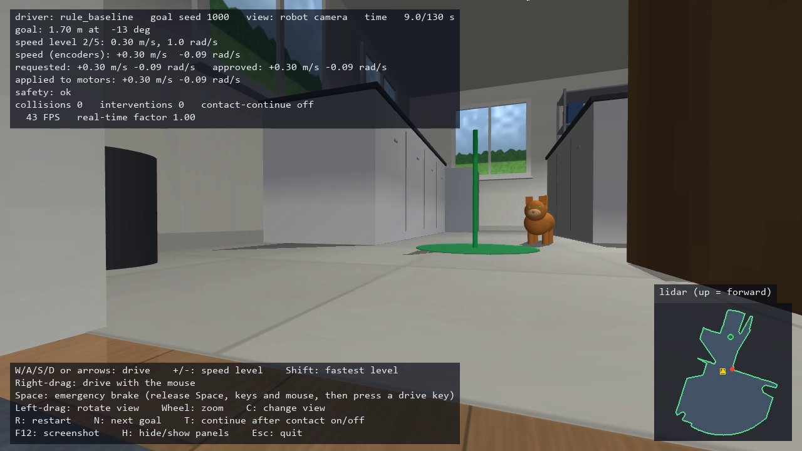 |
| The four cats (brown tabby, ginger tabby, grey tabby, and black and white behind the brown one) down the corridor, in the robot's camera view; the lidar map shows the cats it can detect. | The robot's camera while it drives itself: the goal marker and a cat beside it. |
| 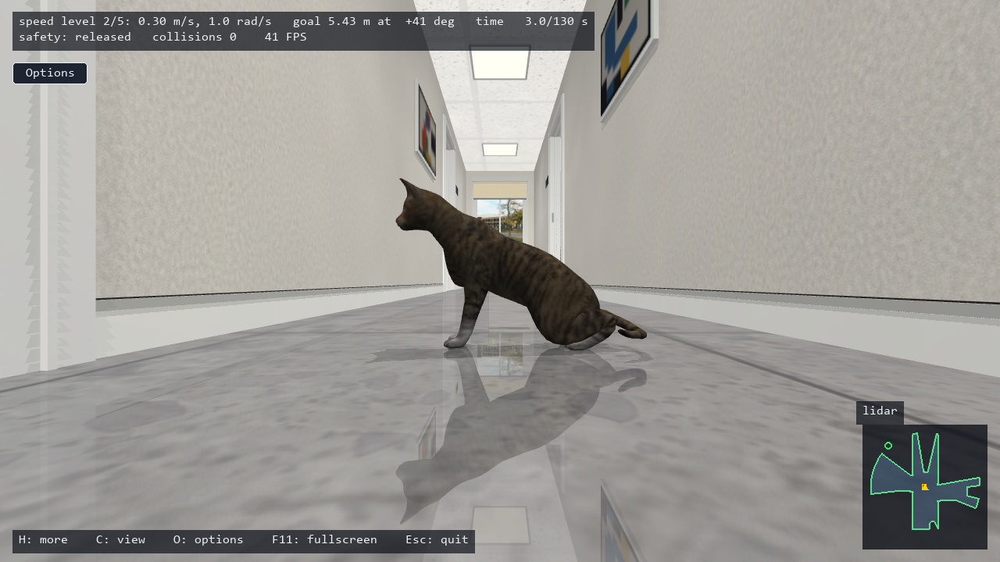 | 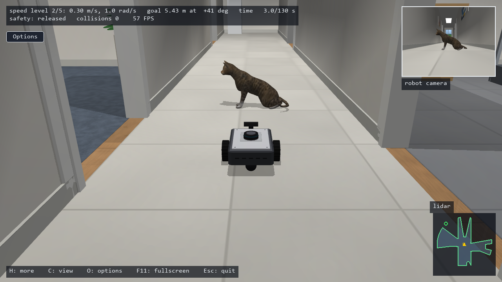 |
| A cat sits down in front of the robot the way a real cat does: haunches down, front legs upright, head level, tail wrapped round on the floor. It sits only where it has room to get up again, and gets up before it moves. | The same cat from behind the robot (chase view). |
| 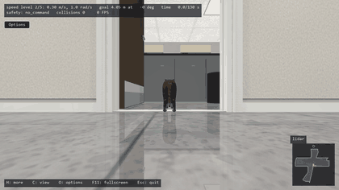 | 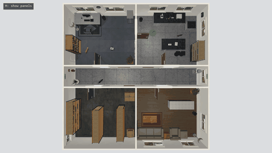 |
| The robot's own camera: a cat resting in the lab doorway turns and steps out of the robot's way, and the robot drives through (no push, no contact). | Time-lapse from above: four cats roam every room while the robot stays parked. |
| 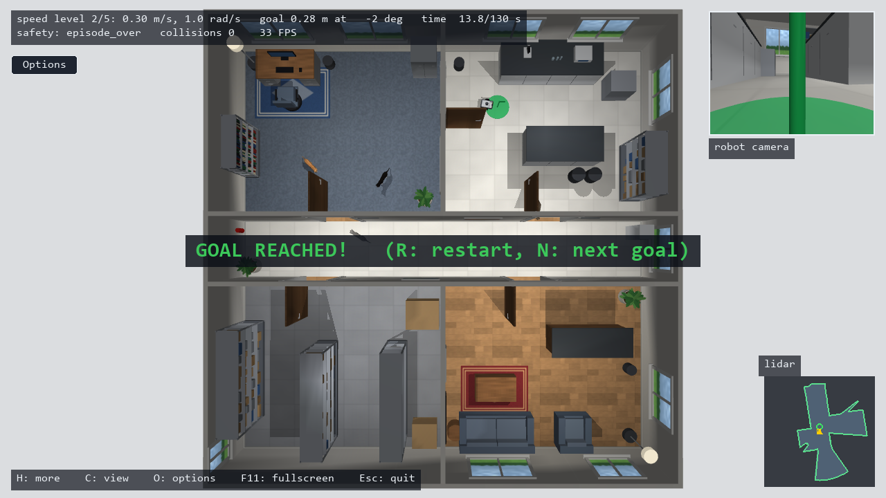 | 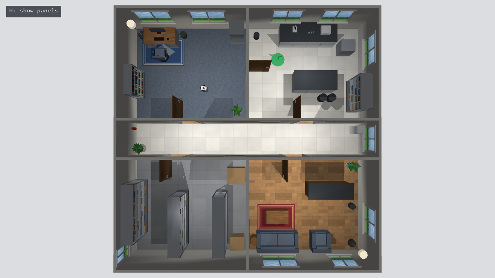 |
| Goal reached, top view: a tabby cat in the corridor and the black cat in the storage room. | The whole 10 x 10 m office floor: office, lab, corridor, storage, and reception. |
| 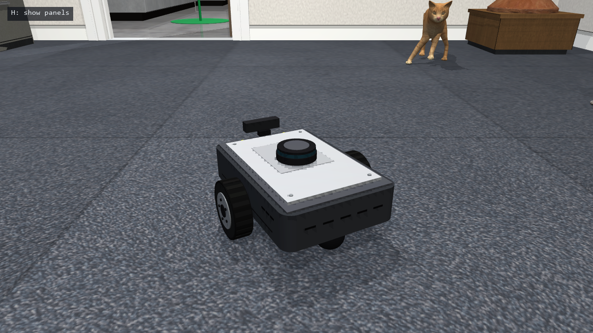 | 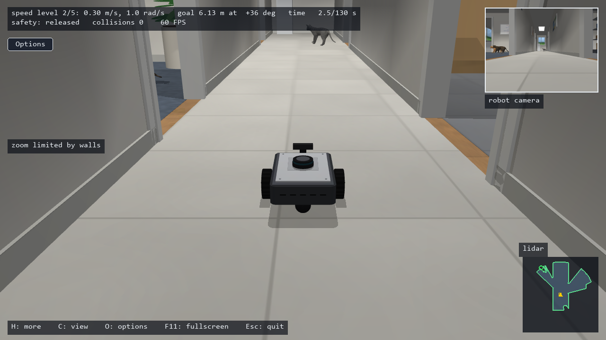 |
| The robot: lidar on top, front camera, two driven wheels, and ball casters. | Driving down the corridor (chase view). |
| 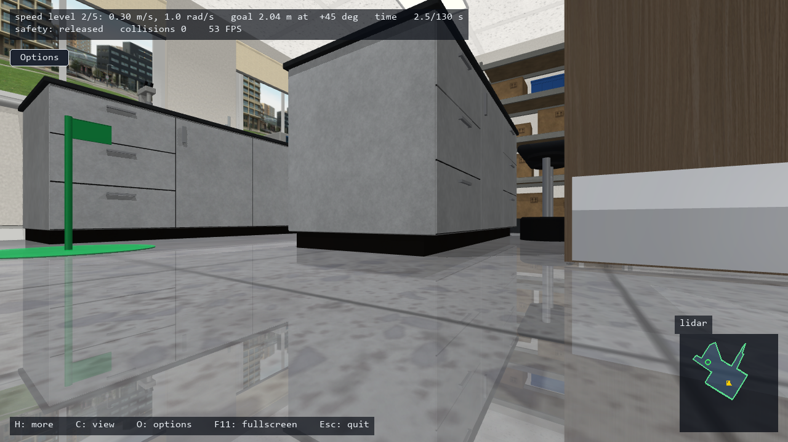 | 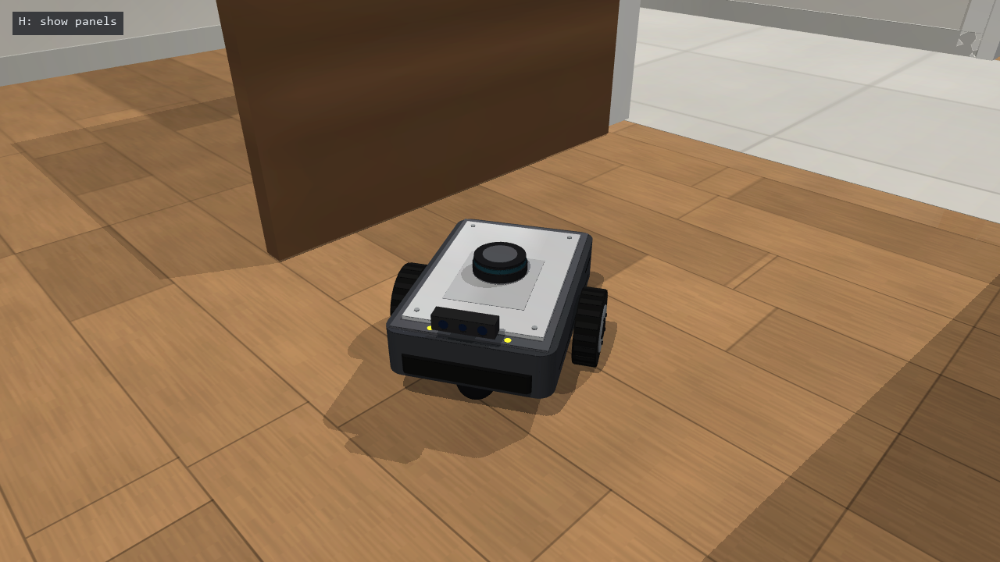 |
| The lab, from the robot's camera. | Reception, with wood floor, rug, and furniture. |
| 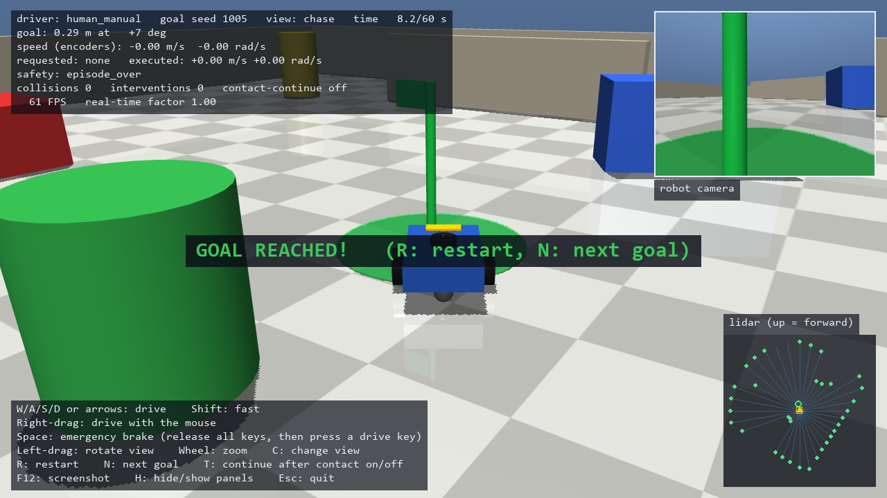 | 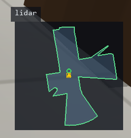 |
| Goal reached, with the full panels (H): every status line, the Options button, the robot camera inset, and the lidar map. | The lidar panel: free space (shaded) and returns (green outline). |


**Contents:** [1. What it is](#1-what-it-is) ·
[2. Setup](#2-setup) ·
[3. Starting the simulator](#3-starting-the-simulator) ·
[4. The window](#4-the-window) ·
[5. Controls](#5-controls) ·
[6. The robot](#6-the-robot) ·
[7. The environment and the task](#7-the-environment-and-the-task) ·
[8. Camera views](#8-camera-views) ·
[9. Tips and troubleshooting](#9-tips-and-troubleshooting) ·
[10. For developers](#10-for-developers)

## 1. What it is

- **Physics:** [MuJoCo](https://mujoco.org/) simulates the robot, its wheels,
  and every wall and piece of furniture at 2,000 steps per second.
- **Robot:** a differential-drive robot (two driven wheels and two ball
  casters) with a lidar, a front camera, and wheel encoders.
- **Driving:** you drive it with the keyboard or mouse. Every command passes a
  safety layer that refuses moves it predicts to be unsafe from the current
  lidar scan.
- **Experiments:** a [Gymnasium](https://gymnasium.farama.org/) environment
  exposes the same robot and safety layer to a program, which is how a
  decision model can drive it.

## 2. Setup

Windows with Python 3.11 (from python.org, which installs the `py` launcher).
In PowerShell, in this folder:

```powershell
.\setup.ps1
```

This creates `.venv\` and installs the pinned packages from `requirements.txt`
(MuJoCo, Gymnasium, Pygame, NumPy, Numba, pytest). It ends with "Setup OK" and the
installed versions. Numba compiles the cats' numeric code (their skeletons, clearance checks, and
planning) on the first run, which takes a few seconds once; it is needed for the cats to run in
real time. Without it the same code runs as plain Python with identical results, about 20 times
slower (fine for tests, too slow for the window).

## 3. Starting the simulator

```powershell
.venv\Scripts\python run_sim.py              # goal seed 1000
.venv\Scripts\python run_sim.py --seed 1003  # another start and goal
.venv\Scripts\python run_sim.py --view 3     # start in the robot-camera view
```

| Option | Meaning |
|---|---|
| `--seed N` | Which start and goal to use (default 1000). The same seed always gives the same task. |
| `--view N` | Starting view: 0 chase, 1 top, 2 orbit, 3 robot camera (default 0). |
| `--speed-level N` | Starting speed level (default 2). |
| `--cats N` | Number of cats at start, 0 to 4 (default 4; 0 turns them off). The Options button changes it while running. |
| `--cat-seed S` | Seed for the cats' behavior (default 0), independent of the goal seed. |
| `--screenshot PATH` | Save a screenshot to PATH when the window closes. |
| `--frames N` | Close after N frames (for automated checks). |
| `--script TEXT` | Hold keys on a schedule, for example `W:2;W+A:1;none:0.5;SPACE:0.3` (for automated checks). |

When the window closes, the terminal prints a summary (status, seed, time,
collisions, interventions, goal distance, frame rate, real-time factor).

## 4. The window

The window can be resized or maximized (down to 960 x 540), and F11 switches to fullscreen.
The app paces frames on its own 60-per-second schedule (it does not wait for the screen's
refresh, which on Windows could stall a covered window for a quarter second); on the tested
Windows desktop the window system showed whole frames. The rate actually reached depends on the
computer and on the scene (for example, how many cats are on). On the tested computer (Windows 11,
GeForce RTX 5060, idle desktop) the 1280 x 720 window with four cats passed the frame-rate check in
every view (`tools\fps_protocol.py --gate`: at least 59.5 frames per second in every trial; measured,
at least 59.8, with 95% of frames within 17.1 ms and none over 25 ms). A large window costs no more to draw than about 1920 x 1080 pixels: beyond
that the picture is drawn at that size and scaled by the graphics card.

**Panels (H cycles them):**

- **Compact (default):** two lines (speed level, goal, time, safety, collisions, frame rate),
  a smaller robot-camera inset, a smaller lidar map, and a one-line key hint. It keeps the
  view clear while driving.
- **Full:** every line below, the full key help, and the larger inset and map.
- **None:** only banners and "H: show panels".

**Status panel (full mode, top left):**

| Line | Meaning |
|---|---|
| `driver`, `goal seed`, `view`, `time` | Who is driving, the task, the camera view, and the episode clock (it stops when the episode ends). |
| `goal` | Distance and bearing to the goal (+ is to the left). |
| `speed level` | The selected speed level; while Shift is held it also shows the fastest level, which is in effect. |
| `speed (encoders)` | **Measured** speed, from the wheel encoders. It can differ from the real motion if a wheel slips. |
| `requested` | What you (or a driver program) asked for. |
| `approved` | What the safety layer allowed. |
| `applied to motors` | What the wheels are actually told now. The velocity smoother ramps toward the approved command, so it lags briefly when you start or stop. |
| `safety` | Why the safety layer changed or stopped a command (see below), or `ok`. When it blocks for clearance, it also lists the moves that are still free, for example "turn left (A), back up (S)". |
| `collisions`, `interventions`, `contact-continue` | Collision count, how often the safety layer had to step in, and whether T (continue after contact) is on. |
| FPS, real-time factor | Frame rate, and simulated seconds per real second (1.00 means real time). |

Safety reasons: `clearance` (the move would get too close to something),
`speed_limit` (above the robot's maximum), `released` (no drive input held),
`emergency_brake`, `focus_lost` (the window lost focus), `episode_over`,
`no_command`, `command_expired` (no fresh command for 0.3 s), `stale_scan`
(the lidar data is older than 0.1 s), `invalid_input`.

**Other panels:**

- **Robot camera (top right):** what the robot's front camera sees. It is
  hidden in the robot-camera view, where the main view already shows it.
- **Lidar map (bottom right):** a top-down map around the robot, up to 3 m,
  with forward pointing up. The shaded area is the free space the lidar sees,
  its green outline is the lidar returns, and red dots mark returns closer
  than 0.5 m. The yellow box is the robot and the green circle is the goal
  direction. Orange lines mark rays with no valid reading.
- **Help (bottom left):** the keys.

**Banners:** "EMERGENCY BRAKE" names exactly what to release; "Release ... and
press again to drive" appears after a restart while a key was still held;
"WINDOW NOT FOCUSED - STOPPED" appears when another window has focus; "GOAL
REACHED!", "COLLISION", or "TIME LIMIT" ends the episode. A red frame around
the window means the robot is touching something.

## 5. Controls

| Input | Action |
|---|---|
| W/A/S/D or arrow keys | Drive: forward, turn left, back up, turn right. Combine them to drive in an arc. Release to stop. |
| + / - (also the keypad) | Raise or lower the speed level (see [6. The robot](#6-the-robot)). It never moves the robot by itself and never releases the brake. |
| Shift (held) | Drive at the fastest level while held; releasing Shift returns to your level. |
| Right mouse button + drag | Drive with the mouse: drag up for forward, sideways to turn. Release the button to stop. |
| Space | Emergency brake (see below). |
| Left mouse button + drag | Rotate the view (chase and orbit views). |
| Mouse wheel | Zoom (chase and orbit views). |
| C | Change view: chase, top, orbit, robot camera. |
| R | Restart this goal. |
| N | Next goal (the next seed). |
| T | Continue after a collision on or off (for testing). |
| H | Panels: compact, full, none. |
| Options button (or O) | Open or close the options beside the panels: click a number of cats (0 to 4) to restart with that many. Driving goes on while they are open; Esc closes them. |
| F11 | Fullscreen on or off. |
| F12 | Save a screenshot to `screenshots\`. |
| Esc | Quit. |

**Emergency brake:** press Space and the robot stops at once and stays
stopped. To drive again, release Space **and every drive input** (keys and the
right mouse button), then press a drive key. R, N, and focus loss never
release the brake, so a held key cannot make the robot jump forward. The
banner always names what is still held.

**Restart while holding a key:** after R or N, a key or mouse button you were
already holding does not drive until you release it and press it again. The
banner names it.

**Focus loss:** if another window takes focus, the robot stops (the window
cannot see key releases while unfocused). Click the simulator window to
continue; if a banner asks you to release a key, release it and press again.

## 6. The robot

- **Size:** 0.30 m long and 0.20 m wide, about 2.6 kg. Wheel radius 5 cm.
- **Motors:** one per wheel, at most 0.3 N·m of torque (like a small gear
  motor). An emergency stop slows the robot at about 4 m/s²; it stops in
  about 3 cm from 0.5 m/s and about 11 cm from 1.0 m/s.
- **Speed levels (manual):** choose with + and -; Shift uses the fastest
  level while held. Reverse runs at half the level's forward speed, because
  there is no rear camera. R and N keep your level.

  <!-- speed-levels: generated from robot_env/config.py SPEED_LEVELS; a test keeps it in sync -->
  | Level | Forward | Turning |
  |---|---|---|
  | 1 | 0.20 m/s | 0.8 rad/s |
  | 2 (default) | 0.30 m/s | 1.0 rad/s |
  | 3 | 0.50 m/s | 1.3 rad/s |
  | 4 | 0.70 m/s | 1.5 rad/s |
  | 5 | 1.00 m/s | 1.5 rad/s |
  <!-- /speed-levels -->
- **Smooth motion:** the motor commands ramp up and down smoothly (speeding up
  at most 1.5 m/s² and 6 rad/s², slowing down at most 3 m/s² and 10 rad/s²).
  Safety stops (emergency brake, focus loss, episode end, missing or stale
  data, a clearance stop) skip the ramp: the motor target becomes zero at
  once, and the wheels and body then come to rest under physics.
- **Sensors:**
  - **Lidar:** 360 rays, 1° apart, in one horizontal plane 0.14 m above the
    floor, range 5 m, 50 scans per second. The simulated scan is ideal: no
    noise, latency, motion distortion, or dropouts other than injected
    faults (a real low-cost lidar also scans more slowly, 5 to 15 times per
    second).
  - **Camera:** forward-facing, 75° field of view.
  - **Wheel encoders:** measured speed.
  - **Goal sensor:** distance and bearing to the goal.
- **Safety layer:** 50 times a second, it predicts the robot's path for the
  requested command (including the time to brake) and keeps a 5 cm gap to
  anything the lidar sees. If the full command is unsafe, it first keeps the
  requested turning and reduces the forward speed, then scales the whole
  command down, and otherwise stops. Near an obstacle, moves that would bring
  it closer are refused, while moves away from it are allowed.

**Known limitations (simulation assumptions):**

- The goal sensor is ideal. A real robot would need localization.
- The lidar sees only one horizontal plane. Things below or above it (a low
  step, a table top) are invisible to it. Objects thinner than the gap
  between neighboring rays can still be missed (in the tested approaches, a
  2.4 cm pole and 4 cm door edges were detected and avoided). A separate contact check records any
  collision honestly, but it does not prevent it.
- Braking and motion are measured in this simulator only, not on hardware.
- The wheel motors are modeled as small gear motors (at most 0.3 N·m each),
  so an emergency stop brakes at about 4 m/s² instead of locking the wheels.
  The ball casters have a soft, damped contact. In tests, starts, stops, and
  emergency stops keep both tires on the floor.
- Walls and furniture are simple shapes (boxes and cylinders). The tire
  sidewalls do not collide: each tire touches the floor at one point.

## 7. The environment and the task

- **Floor:** 10 x 10 m, with a 1.4 m wide east-west corridor; an office and a
  lab to the north; storage and reception to the south. Doorways are 0.9 m
  clear, and all doors stand open.
- **Physical vs visual:** walls, door leaves, furniture, and clutter on the
  floor are solid: they collide and the lidar sees them. Rugs, windows,
  pictures, signs, the ceiling, and the light panels are visual only. The
  robot drives over rugs as if they were part of the floor.
- **Furniture:** the office furniture is drawn by detailed models (a steel
  desk, steel and wood shelving, a planter on a stand: CC0 models from Poly
  Haven; an office chair, a filing cabinet, a waste bin, and a floor lamp made
  in code). What collides and what the lidar sees are simple boxes and
  cylinders fitted to each model: never more than 2 cm from what you see, and
  nothing visible sticks out of them by more than 1 cm. Open frames are honest:
  the robot (0.1355 m tall) fits under the desk's pedestals, as it would under a
  real desk. The lidar is a single plane at 0.1355 m, so every solid the robot
  can touch crosses that plane or stands under one that does; that is why the
  chair has four legs rather than a low star base and the shelf stands on
  levelling feet.
- **Task:** drive to the green goal marker (within 0.3 m) in 130 s without a
  collision. The start and goal are always in different rooms (or the
  corridor), so every task passes through a doorway. The seed fixes both;
  seeds 1000 to 1009 are the held-out evaluation tasks, frozen as exact start
  and goal positions (`HELDOUT_TASKS` in `robot_env/config.py`), so changing the
  furniture never changes the evaluation set.
- **Episode end:** reaching the goal, a collision (unless T is on), or the
  time limit. The robot then stops; press R to retry or N for the next goal.

### Cats (on in the window)

The window starts with four cats; the Options button on the panels (or O) changes the number,
0 to 4, and restarts with that many (`--cats N` sets it at start). The Python API and
the Gymnasium environment start with none unless asked (`RobotSystem(cats=3)`,
`RobotGoalEnv(cats=3)`), so training and the baseline runs stay comparable.

```powershell
.venv\Scripts\python run_sim.py --cats 2 --cat-seed 16
```

- **What they are:** a rigged, textured cat model ("Cat" by Vr-cvantorium, see Credits) with
  four coats (brown tabby, ginger tabby, black and white, grey tabby). Each cat walks with a
  real four-beat gait (a trot when faster), its paws planted on the floor while they bear
  weight; it turns on the spot with small pivot steps, turns its head to watch the robot,
  breathes, and sways its tail, raising it when the robot comes close. A cat whose next step
  would take a paw too close to a wall puts that paw back down instead. A cat that sits really
  sits: it settles its paws and stills its tail, lowers its haunches onto its folded hind legs
  with its front legs upright and its head level, and wraps its tail round on the floor. It
  sits only where the whole sit-down and getting up again fit, other cats keep clear of the room
  it needs to get up, and it is fully up (0.5 s) before it moves, or as soon as the robot comes
  near.
- **What they do:** cats roam the whole floor. They walk, pause, sit, dart, and travel from room
  to room, preferring rooms they have not visited for a while. A local planner (every 0.1 s it
  compares about 50 possible motions it could make and still stop in time) keeps each cat clear
  of walls and furniture (3 cm), other cats (5 cm), and the robot (0.3 m), checked over every
  move, not only where it ends. A cat stuck in a tight corner works out a way out step by step,
  two cats meeting in a narrow place give way to each other, and a cat hemmed in by others
  looks for a way out again as they move.
- **Measured roaming** (`tools\roam_check.py --repeat`: 20 fixed cat seeds, 10 simulated
  minutes each, robot parked): the three cats together reached all five rooms within 96 s in
  every seed; each cat reached every room within 10 minutes in 19 of the 20 seeds; no cat that
  wanted to move stood still for more than 4 s; no contacts, and no gap more than 0.2 mm under
  its limit at any physics step (the allowance is 1 mm); a second run of the same seed matched
  the first step for step. This is a property of these seeds, not a promise for every run.
- **Doorways:** cats pass through doorways and the corridor but never rest there. A cat in the
  robot's path steps out of the way when the robot comes toward it (hurrying, up to 1 m/s, when
  the robot closes in fast), or when the robot is waiting for it (a drive request held back by
  the safety layer); a parked robot does not chase cats away, and a cat does not react to a
  robot it cannot see (behind a wall). The robot waits; it never pushes a cat.
  `tools\doorway_check.py` runs every doorway, both directions, every speed level, and both
  resting states (100 trials): all pass, with no contacts, and the cat as drawn never came
  closer than 21 cm to the robot.
- **What the robot senses:** each cat has fourteen solid collision shapes fitted to the model
  (body, head, legs, and tail), so it collides with the robot and the lidar detects it (a cat
  hidden behind another object is not seen). Only the ears are visual. A robot driving up to a
  cat may come closer than the cat's own 0.3 m comfort distance, down to the robot's 5 cm safety
  buffer: the robot's controller does not keep a larger distance from animals yet.
- **Collisions:** touching a cat counts as a collision (it ends the episode by default). The
  run records which cat, who moved into whom (from both speeds along the contact normal),
  the peak contact force, the impulse, and the duration. A touching cat freezes at once and
  stays still until it is clear of the robot; in the test where a cat walks into the stopped
  robot, the robot moved less than 1 cm.
- **Seeds:** the same `--cat-seed` reproduces the cats only when everything else is the same
  too: the same world, goal, driving commands and their timing, and settings. Manual
  driving is never exactly repeatable, so neither are the cats around it.
- **Limitation:** the safety layer treats each lidar scan as a still snapshot (refreshed 50
  times a second); it does not yet predict where a moving object is going. So cats are a
  demonstration and experiment feature, not evidence that the robot is safe around moving
  animals or people. Velocity-aware prediction is planned.

## 8. Camera views

| View | What you see |
|---|---|
| Chase | Behind the robot, following its heading smoothly. Near walls and furniture the camera keeps your angle and moves in closer along it, so it never enters anything and keeps the robot and the way ahead in view; only when even 0.6 m is not clear does it look down more steeply or swing to the side. It looks ahead for edges (door jambs, shelves) and starts gliding before it reaches them, and its own movements are capped at 3.5 m/s (about 6 cm per frame at 60 frames per second). It keeps at least 0.4 m from the robot and widens its view up to 70 degrees when walls hold it close, so the robot and its surroundings stay in frame. If no clear angle exists, a note says so (press C for another view). |
| Top | The whole floor from above, with the ceiling cut away. |
| Orbit | Like chase, but it does not turn with the robot; rotate it with the left mouse button. |
| Robot camera | The robot's own front camera (with the ceiling). |

Left-drag rotates and tilts and the wheel zooms in the chase and orbit views, like the camera
in a third-person game. A drag shows in the same frame, at any speed. Each notch changes the
distance by 12 percent and the view gets there in about a tenth of a second, without
overshooting, at any frame rate. Zooming out sets the distance you want; where walls keep the
camera closer, "zoom limited by walls" appears and the camera returns to your distance (within
about a second) once there is room. Zooming in always starts from where the camera is, so the
first notch shows. Where walls or furniture right behind the robot leave no room at a shallow
angle, the camera stays steeper and "tilt limited by walls" appears. R and N restore the
default view. C cycles the views.

## 9. Tips and troubleshooting

- **The robot will not move:** read the `safety` line. `released` means no
  drive key is held. `clearance` lists the moves that are still free: back up
  or turn first. `emergency_brake` means Space is latched (see the banner).
- **It stopped when I clicked another window:** focus loss stops the robot.
  Click the simulator window again.
- **A key "does nothing" after R or N:** release it and press it again.
- **Slow frame rate:** the real-time factor in the panel shows whether the
  simulation keeps up. Fewer panels (H) or a smaller window help on slow computers.
- **Screenshots:** F12 saves to `screenshots\`; the QA tools save to
  `qa_output\`.
- **Rebuild after changing the layout:** run
  `.venv\Scripts\python tools\build_world.py` (and
  `tools\make_textures.py` for textures). Do not edit `robot_env/world.xml`
  by hand: it is generated, and a test checks that.

## 10. For developers

### How a command reaches the wheels

Every driver, whether keyboard, test, or a future decision model, uses the
same path:

```text
 driver.decide(observation) -> Decision(command)
   -> RobotSystem.apply(decision) -> drive(v, omega)
   -> 50 Hz control tick: lidar scan -> SafetyLayer -> approved command
   -> every 2 kHz physics step: velocity smoother -> wheel motors -> MuJoCo physics, contact check
```

A driver only implements `decide`:

```python
from robot_env.types import Command, Decision

class MyDriver:
    name = "my_driver"

    def decide(self, obs):  # obs: lidar, lidar_valid, velocity_estimate, goal_distance, goal_bearing, ...
        return Decision(Command(0.3, 0.0), obs.seq)   # (v m/s, omega rad/s)
```

Run it in the window with `App(seed, driver=MyDriver()).run()` (from
`robot_env.app`). Space, focus loss, and the episode end still stop any
driver.

### Gymnasium

```python
from robot_env.env import RobotGoalEnv
env = RobotGoalEnv()
obs, info = env.reset(options={"task_seed": 1000})
obs, reward, terminated, truncated, info = env.step([0.3, 0.0])  # [v m/s, omega rad/s], one step = 0.1 s
```

- **Action:** `[v, omega]`, limited to the fastest speed level (±1.0 m/s) and
  ±1.5 rad/s. The safety layer applies to every action.

- **Observation:** `lidar` (360 ranges, one per degree), `lidar_valid`, `velocity_estimate`
  (encoders), `goal` (distance, bearing).
- **Reward:** progress toward the goal, +10 on success, -10 on a collision,
  -0.1 per safety intervention.
- **`info`:** the approved and applied commands, the safety reasons, collision
  and intervention counts, and the true pose and velocity (`ground_truth`,
  for evaluation only; never give it to a driver).
- **Discrete actions:** `robot_env/actions.py` defines 5 actions (forward,
  turn left, turn right, stop, back up) for decision models that choose from
  a list.

### Files

| File | What it does |
|---|---|
| `robot_env/world.xml` | The office floor, goal marker, and robot (generated by `tools/build_world.py`) |
| `robot_env/assets/` | Floor, wall, door, and sign textures (generated by `tools/make_textures.py`) |
| `robot_env/assets/furniture/` | Furniture meshes and textures (`tools/fetch_models.py`, `tools/proc_furniture.py`); `MANIFEST.json` lists each source, licence, and file checksum |
| `robot_env/sim.py` | Physics, lidar, camera, wheel encoders, contact detection |
| `robot_env/safety.py` | Safety layer: hard stops, speed limits, clearance prediction |
| `robot_env/system.py` | The one path from any driver to the wheels, including the velocity smoother |
| `robot_env/layout.py` | Room map, seeded start and goal, path check |
| `robot_env/env.py` | Gymnasium environment (`RobotGoalEnv`) |
| `robot_env/actions.py` | The 5 discrete actions |
| `robot_env/manual.py`, `robot_env/app.py` | Manual driving and the window |
| `robot_env/config.py` | Every tunable number |

### Tests and QA tools

```powershell
.venv\Scripts\python -m pytest
```

| Command | What it does |
|---|---|
| `.venv\Scripts\python tools\qa_human_drive.py [seeds]` | Drives the held-out goals (or the given seeds) in the real window with real key events. It is a privileged scripted check that reads the true pose and map, not a substitute for a person driving. Keep the desktop idle while it runs: focus loss stops the robot by design. |
| `.venv\Scripts\python tools\qa_screens.py` | Saves screenshots of the corridor, rooms, doorways, and robot to `qa_output\` |
| `.venv\Scripts\python tools\build_world.py` | Regenerates `world.xml` after layout changes |
| `.venv\Scripts\python tools\make_textures.py` | Regenerates the textures in `robot_env/assets/` |
| `.venv\Scripts\python tools\furniture_check.py` | Checks every furniture model against its solid shapes (protrusion, surface distance, open frames, support) and that the lidar can see everything the robot can touch |
| `.venv\Scripts\python tools\world_diff.py --base REV` | What changed in the solid world since a revision: shapes, the planning map, lidar scans, routes through every doorway, and 1,000 sampled tasks |
| `.venv\Scripts\python tools\fetch_models.py --check` | Converts the furniture models again (and the procedural ones) and confirms the files are byte-identical |
| `.venv\Scripts\python tools\eval_baseline.py --set heldout --levels 1 2 5 --out qa_output\baseline_heldout.json` | Evaluates the rule-based baseline driver headless (see below). `--set dev` uses the tuning seeds 2000 to 2019; `--logs DIR` writes a drive log per episode. |
| `.venv\Scripts\python tools\fps_protocol.py` | Measures rendered performance: 3 or more trials per view, frame-time percentiles, late frames, real-time factor, and the host details. Add `--note` to record background load; `--gate` fails unless, with 4 cats, every trial of every view reaches 59.5 frames per second (the 60-per-second schedule), with 95% of frames within 20 ms, none over 50 ms, and a real-time factor of at least 0.99. |
| `.venv\Scripts\python tools\roam_check.py --repeat` | Cats roaming: 20 cat seeds, 10 simulated minutes each: rooms reached, stalls, gaps, contacts, and a repeat run compared step by step. |
| `.venv\Scripts\python tools\doorway_check.py` | A cat in each doorway with the robot coming through: every door, both directions, every speed level, both resting states (100 trials). |
| `.venv\Scripts\python tools\gait_check.py` | The cats' gait: paws planted without slipping, nothing below the floor, no joint jumps, at every speed and turn they use. |
| `.venv\Scripts\python tools\interp_check.py` | The cats' 100-per-second motion against a 2000-per-second reference, including contacts with the robot. |
| `.venv\Scripts\python tools\kernel_paths_check.py` | The cat tests and gait check with the compiled code, as plain Python, and without Numba installed. |

### Baseline driver

`robot_env/baseline.py` is a rule-based reference driver, so later changes can be compared
honestly. It sees only the observation, like any driver:
- it integrates its own odometry from the encoder speeds;
- it builds its own occupancy map from the lidar;
- it plans to the goal on that map and backs up when stuck.

On the held-out goals with ideal sensors it reaches 8, 9, and 10 of 10 goals at levels 1, 2,
and 5, with no collisions. Its failures come from odometry drift on long runs.

### Drive logs

`robot_env/drive_log.py` writes one JSON-lines file per episode (a reset closes and detaches a
log that is already in use; attach a new one for the next episode). Attach it with
`system.log = DriveLog(path, task_seed=...)` and finalize it with `with DriveLog(...) as log:`,
`log.close()`, or `system.close()`; `read_log(path)` rejects a truncated, failed, or
inconsistent log. It records:
- a header: format version, profile, seeds, configuration hash, and host;
- one record per 50 Hz control tick: requested, approved, and applied commands; safety
  reasons; contact; encoder speeds; and the full lidar scan, stored losslessly with a
  checksum;
- episode events, and with cats their state changes and contacts (start and end).

Ground truth appears only under `evaluation_only_truth`. Read a log back with `read_log(path)`.
Logging never changes the robot's behavior, and a write failure only stops the log.

### Credits

- "Cat" by [Vr-cvantorium](https://sketchfab.com/Vr-cvantorium)
  ([source](https://sketchfab.com/3d-models/cat-a503ae2a7bdd43ada7f3bea3ae0a523f)), licensed under
  [CC BY 4.0](https://creativecommons.org/licenses/by/4.0/). Modified: converted to a MuJoCo
  skinned rig, and the coat textures were recoloured and repainted
  (`robot_env/assets/cat/manifest.json` records the source file, its checksum, and the steps).

- Furniture models from [Poly Haven](https://polyhaven.com), licensed
  [CC0](https://polyhaven.com/license): "Metal Office Desk" by Ulan Cabanilla, "Steel Frame
  Shelves 01" by James Ray Cock, "Potted Plant 01" by Rico Cilliers (source files and checksums in `robot_env/assets/furniture/MANIFEST.json`).
  Converted to MuJoCo meshes and simplified by `tools/fetch_models.py`.

### Notes

- The Python environment (`.venv\`) lives in this folder, so Google Drive
  syncs it. It is not in Git; rebuild it with `setup.ps1` on another computer.
- Use one active computer at a time for this folder. Clone from GitHub
  elsewhere.
